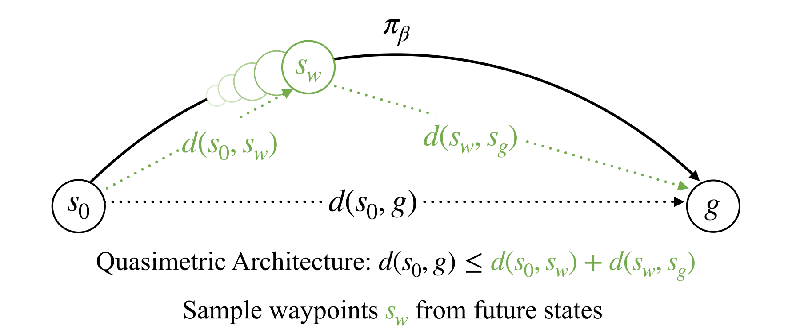

    <h1> Multistep Quasimetric Learning for Scalable Goal-conditioned Reinforcement Learning </h1>
    <h2> Bill Zheng, Vivek Myers, Benjamin Eysenbach, Sergey Levine </h2>
    <h2> ICLR 2026 </h2>
      

This repository contains the implementation of Multistep Quasimetric Estimation (MQE) in OGBench. We also include the following baselines:
* Goal-conditioned behavior cloning (GCBC)
* Goal-conditioned implicit Value/Q-learning (GCIVL/GCIQL)
* Hierarchical implicit Q-learning (HIQL)
* Quasimetric reinforcement learning (QRL)
* N-Step goal-conditioned soft actor-critic + behavior cloning (NGCSAC+BC)
* Contrastive Reinforcement Learning (CRL)
* Contrastive Metric Distillation (CMD)
* Temporal Metric Distillation (TMD)

---

## Key Files

### Agent Implementations
| File | Description |
|------|-------------|
| `impls/agents/mqe.py` | MQE agent (main paper algorithm) |
| `impls/agents/hiql.py` | HIQL baseline |
| `impls/agents/tmd.py` | TMD baseline |
| `impls/agents/crl.py` | CRL baseline |
| `impls/agents/qrl.py` | QRL baseline |
| `impls/agents/gciql.py` / `gcivl.py` | GCIQL / GCIVL baselines |
| `impls/agents/gcbc.py` | GCBC baseline |
| `impls/main.py` | Main training entry point |

### Visual Environment Experiments (MQE, HIQL, TMD on pixel-based OGBench)
| File | Description |
|------|-------------|
| `run_experiment.sh` | Unified SLURM script — parameterized by `AGENT`, `ENV`, `SEED` |
| `submit_jobs.sh` | Submit pilot (seed 0) or full (seeds 0–3) runs across all agent/env combos |
| `sync_results.sh` | Rsync eval CSVs from Great Lakes to local machine |
| `aggregate_results.py` | Parse eval CSVs and print per-seed + mean ± stderr results table |
| `plot_results.py` | Generate bar chart of final performance across agents and environments |
| `RUNS.md` | Full experiment log: job IDs, durations, per-task results, setup history |

### State-Based & Stitch Environment Experiments (teammates)
| File | Description |
|------|-------------|
| `run_hiql_stitch.slurm` | SLURM array job for HIQL on antmaze stitch environments (gpu_mig40) |
| `run_tmd_stitch.slurm` | SLURM array job for TMD on antmaze stitch environments (gpu_mig40) |
| `sbatch_hiql.sh` | Submit HIQL on state-based OGBench environments |
| `sbatch_mqe.sh` | Submit MQE on state-based OGBench environments |
| `sbatch_baselines.sh` | Submit GCBC/GCIQL/QRL/CRL baselines on state-based environments |
| `sbatch_scene_noisy.sh` | Submit runs on scene-noisy environment |

### Setup & Data
| File | Description |
|------|-------------|
| `setup_greatlakes.sh` | One-time environment setup on Great Lakes HPC |
| `download_dataset.py` | Download OGBench datasets (visual-cube-triple-play, visual-scene-play) |
| `impls/hyperparameters.sh` | Reference hyperparameters for all agents across all OGBench environments |
